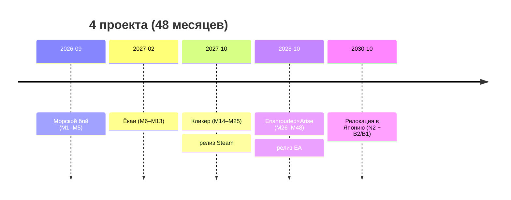

# ROADMAP: 4 проекта за 48 месяцев (сент 2026 → авг 2030)

> **Правило №1**: дедлайны фиксированы, режется скоуп (не наоборот).
> **Правило №2**: буфер = последний месяц этапа.
> **Правило №3**: после каждого этапа — 1 неделя отпуска (анти-выгорание).
> **Команда**: разработчик (весь код, архитектура, CI/CD) + геймдизайнер (дизайн, баланс, контент, нарратив).
> **Цель**: портфолио для релокации в Японию (Q4 2030 – Q1 2031, японский N2 + англ. B2/B1).

---

## Обзор

| Этап | Проект | Окно | Длит. | Чекпоинт выхода |
|---|---|---|---|---|
| 1 | **Морской бой** | М1–М5 (сент 26 – янв 27) | 5 мес | Играбельна по сети, репо упаковано |
| 2 | **Survivors «Ночь Ёкаев»** | М6–М13 (фев – сент 27) | 8 мес | 10k+ врагов без просадок, CI зелёный |
| 3 | **Кликер «Лавка Алхимика»** | М14–М25 (окт 27 – сент 28) | 12 мес | **РЕЛИЗ В STEAM** |
| 4 | **Enshrouded × Tales of Arise** | М26–М48 (окт 28 – авг 30) | 23 мес | **Ранний доступ, первый мир** |

---

## ЭТАП 1. Морской бой — М1–М5 (сент 2026 – янв 2027) — ТЕКУЩИЙ

### Пройденный путь ✅

- [x] Создан проект UE 5.5.0 (шаблон Third Person, C++) — `SeaBattle-ue5`
- [x] git init + `.gitignore` для UE + первый коммит + push на GitHub
- [x] **Модуль 1–2**: компоненты `USceneComponent` / `UStaticMeshComponent`, `RootComponent` (корабль pirate_ship, клетка Plane + M_CellMaterial)
- [x] **Модуль 3**: жизненный цикл `BeginPlay`/`Tick`, `DeltaTime` (движение `Speed * DeltaTime`), трансформации `FVector`/`FRotator`, конечный автомат «патруль» (плавный разворот на границе)
- [x] Бонус сверх плана: `PostEditChangeProperty` + `#if WITH_EDITOR` + `FMath::IsNearlyZero` (защита от `TurnSpeed = 0`)
- [x] Тест модуля 3: 5/5

### Текущий этап 🔄

- [ ] **Модуль 4 — система отражения**: `UCLASS` / `UPROPERTY` / `UFUNCTION` / `UObject`, рефлексия глубже, `BlueprintCallable` / `BlueprintReadOnly`

### План М1–М5

- [ ] **М1 (сент 26)**: Модуль 4 (отражение) финал + C++ гл. 11–12 (наследование, полиморфизм, виртуальные функции)
- [ ] **М2 (окт 26)**: Модуль 5 (Gameplay Framework: GameMode/GameState/PlayerController/Pawn) + UMG-база + C++ гл. 13–15 (шаблоны, STL, умные указатели)
- [ ] **М3 (ноя 26)**: Чистая C++-логика: поле 10×10, расстановка, правила, попадания + **gtest**
- [ ] **М4 (дек 26)**: Сеть: Listen Server, Replication, ходы по сети, UMG (меню, лобби, поле)
- [ ] **М5 (янв 27)**: Полировка + буфер + портфолио-упаковка
  - [ ] README (описание, скриншоты, как запустить)
  - [ ] Видео-демо
  - [ ] Тест на 2 машинах (сеть)

> 📄 Полный ГДД: `docs/GDD-SeaBattle.md`

---

## ЭТАП 2. Survivors «Ночь Ёкаев» — М6–М13 (фев – сент 2027)

- [ ] **М6**: MassEntity (фрагменты, процессоры), Unreal Insights, вертикальный срез 10 000 врагов
- [ ] **М7**: Мини-ECS на чистом C++ + бенчмарк vs Actor-ы, пул объектов
- [ ] **М8**: Геймплей-ядро: волны, авто-атаки, XP, «1 из 3» апгрейды, ночь→рассвет
- [ ] **М9**: Боссы, арены, эффекты (чернила, партиклы), HUD
- [ ] **М10**: GitLab CI (self-hosted runner, RunUAT при пуше) + gtest + UE Automation Tests
- [ ] **М11–М12**: Контент (дизайнер): 15+ ёкаев, 3 арены, боссы; баланс, полировка
- [ ] **М13**: Буфер + портфолио-пакет: трейлер, техническая страница (ECS, цифры производительности)

---

## ЭТАП 3. Кликер «Лавка Алхимика» — М14–М25 (окт 2027 – сент 2028)

- [ ] **М14–М15**: Прототип клика: золото, улучшения, комбо/криты, «сочность»
- [ ] **М16–М17**: День-забег: репутация, покупатели, события, рецепт дня, экспедиция
- [ ] **М18**: Мета: Эссенция, талисманы, престиж «Возрождение Котла»
- [ ] **М19–М20**: Контент-марафон (дизайнер): 30 рецептов, 20 ингредиентов, 15 покупателей, 20 событий, 5 биомов
- [ ] **М21**: Сейвы JSON, локализация RU/EN/JA, Steamworks (достижения, облака, карточки)
- [ ] **М22**: Страница Steam, капсулы, wishlist, демо-сборка
- [ ] **М23**: Next Fest, отзывы, фиксы
- [ ] **М24**: Полировка, баланс, финальный контент, чек-листы Steam
- [ ] **М25**: **РЕЛИЗ** + первые патчи + буфер

---

## ЭТАП 4. Enshrouded × Tales of Arise — М26–М48 (окт 2028 – авг 2030)

- [ ] **М26–М27**: Предпродакшн: ГДД первого мира, вертикальный срез (персонаж, бой, арт-тест), архитектура, ассет-стратегия
- [ ] **М28–М29**: Персонаж: движение, камера, комбо-бой, мобы
- [ ] **М30–М31**: Крафт/выживание: ресурсы, инструменты, базы, инвентарь, костяк квестов
- [ ] **М32–М33**: **Кооп до 14**: Listen Server, репликация, авторитет сервера, толпы через MassEntity
- [ ] **М34**: Оптимизация: Nanite, HLOD, World Partition, Insights, нагрузочный тест на 14 клиентах
- [ ] **М35–М37**: Мир 1: ландшафт, биомы, данжи, боссы, NPC, лор
- [ ] **М38**: Прокачка, скиллы, снаряжение
- [ ] **М39–М41**: Полировка, баланс, оптимизация, Automation-тесты, баг-трекинг
- [ ] **М42–М43**: Alpha: закрытый плейтест, фидбек
- [ ] **М44–М45**: Beta: контент-фриз, критичные фиксы, производительность + промо-сайт (HTML5+CSS3)
- [ ] **М46–М47**: Ранний доступ: страница Steam, трейлер, wishlist-кампания, публикация сайта
- [ ] **М48**: **РЕЛИЗ РАННЕГО ДОСТУПА** с первым миром + буфер
- [ ] **После М48**: фикс первых багов (1–3 мес) → **РЕЛОКАЦИЯ В ЯПОНИЮ**

---

## Параллельные дорожки

- [ ] **Японский язык → N2** к переезду: N5 (2026) → N4 (2027) → N3 (2028–29) → N2 (2030)
- [ ] **Английский → B2/B1**: рабочий уровень, практика на документации и контенте
- [ ] **Git**: коммит минимум раз в 2 недели; каждый этап — ридми + скриншоты + видео
- [ ] **C++ теория**: закрыть гл. 11–18 Праты в М1–М2 (обязательно до М3)
- [ ] **Промо-сайт (HTML5+CSS3)**: контент копится в этапе 4, вёрстка М44–М45, публикация М46–М47 (версии EN + JA)

---

## Решение по релокации

Переезд в Японию — **после** релиза этапа 4 (ранний доступ) и фикса первых багов (1–3 мес) → Q4 2030 – Q1 2031.
Этап 4 — **главный проект портфолио** для работодателя. Этапы 1–3 — ступени: учебный → технический шоукейс → коммерческий цикл.
К этапу 4 — промо-сайт на чистом HTML5+CSS3 (лендинг, скриншоты, трейлер, тех-разбор, контакты; версии EN + JA).
