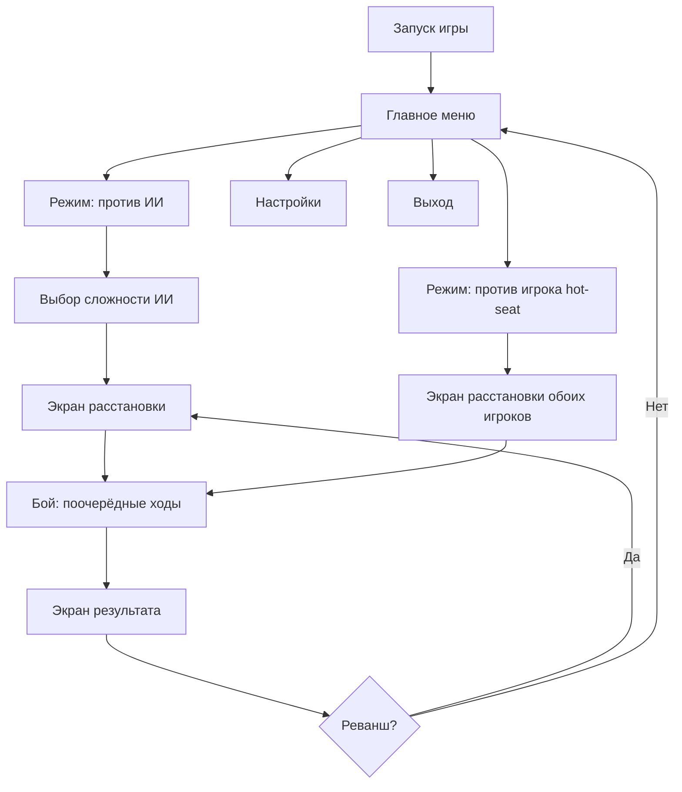

# ГДД «Морской бой» (SeaBattle) — учебный проект, Этап 1 роадмапа

> Версия: 0.4 (локальный режим hot-seat как ядро, сеть — stretch) · Автор: ly4dobra + геймдизайнер (жена) · Дата: авг 2026
> Статус: в разработке (Модуль 4 — система отражения)

---

## 1. HIGH CONCEPT

Классический «Морской бой» на поле 10×10 в двух режимах: **против ИИ** (три уровня сложности)
и **против человека на одном ПК** (hot-seat, передача хода). Сетевая игра (Listen Server) —
**stretch**: для демки достаточно локального режима.

Игровая логика — на чистом C++ (без зависимостей от UE) → тестируется gtest и демонстрирует
чистую архитектуру — «японский козырь №2».

**Питч:** «Тот самый морской бой из тетрадки, но с пиратским кораблём, водой, умным ИИ и другом за одним столом».

---

## 2. РЕШЕНИЯ (зафиксировано)

| № | Вопрос | Решение | Обоснование |
|---|---|---|---|
| 1 | Таймер хода | **Stretch** | Ядро (режимы + Core + gtest) важнее; таймер легко добавить в конце |
| 2 | Способ расстановки | **Drag & drop, захват за ЛЮБУЮ часть корабля** | Привычный UX; привязка к ближайшей клетке; поворот — клавишей R |
| 3 | Имя игрока | **Хранить в настройках** (сохраняется между сессиями) | Не вводить каждый раз; используется в hot-seat и статистике |
| 4 | Сетевая игра | **Локальный режим (hot-seat) — ядро v0.1; сеть (Listen Server) — stretch** | Для демки достаточно локального. Сеть — обязательный навык для Этапа 4 (кооп 14) → если не успеем в М4, сетевой мини-этап (2–4 нед) перед Этапом 4 |
| 5 | Реванш | Открыто (решаем на М5) | Варианты: общее согласие / поменяться полями |

---

## 3. ЦЕЛИ ПРОЕКТА

| Цель | Тип | Критерий успеха |
|---|---|---|
| Освоить Gameplay Framework | Учебная | GameMode/GameState/PlayerController/Pawn используются по назначению |
| Сеть (Listen Server) | Учебная (stretch) | Полная партия по сети на 2 машинах (если успеем в М4, иначе мини-этап перед Этапом 4) |
| Чистая архитектура C++ | Техническая | Логика в модуле Core без `#include "Engine/..."`, покрыта gtest |
| ИИ-противник | Техническая | 3 уровня (случайный / охотник / вероятностная карта) + gtest |
| UMG-интерфейс | Учебная | Меню, hot-seat, поле, экран результата |
| Портфолио | Карьерная | README + скриншоты + видео, репо в GitHub |

---

## 4. ПРАВИЛА (спецификация логики)

### 4.1 Поле и флот
- Поле 10×10, координаты A1…J10 (строки A–J, столбцы 1–10).
- Флот: 1 корабль × 4 палубы, 2 × 3, 3 × 2, 4 × 1 (всего 10 кораблей, 20 клеток).
- Корабли не касаются друг друга (включая углы) — минимум 1 клетка между.
- Корабли можно располагать горизонтально и вертикально.

> **Архитектурно:** размер поля и состав флота — параметры `BattleCore` (не хардкод).
> UI v0.1 показывает только 10×10, но Core умеет 8×8 и 12×12 → богаче gtest, проще включить настройку «размер поля» позже.

### 4.2 Ход игры
- Игроки стреляют по очереди. Ход передаётся только после **промаха**.
- Попадание → повторный ход. Отметка «ранен» / «убит» (когда все палубы корабля поражены).
- Победа: уничтожен весь флот противника.
- Случайный выбор первого хода.

### 4.3 Локальная игра (hot-seat, ядро v0.1)
- Оба игрока на одной машине. Один экран: текущий игрок видит «свою» перспективу (своя сетка + туман войны по чужой).
- После промаха — экран «Передайте устройство игроку X» + кнопка «Я готов» (чтобы не подглядывать чужое поле).
- Вся логика локальная: GameState живёт на одной машине, сеть не задействована.

### 4.4 Сеть (stretch — если вернёмся)
- Решения принимает сервер (авторитетная логика через `BattleCore`), клиент шлёт намерение (RPC).
- Очередь хода защищена на сервере: клиент не может выстрелить не в свой ход или в уже обстрелянную клетку (ответ `Invalid`).

---

## 5. КАРТА СОСТОЯНИЙ И ЮЗЕРФЛОУ



Ключевой принцип: **обе ветки сходятся в одинаковом бою**. ИИ — это «второй игрок»,
который живёт локально и ходит по алгоритму. Тот же интерфейс, та же логика Core.
Один бой — два источника второго игрока (ИИ или второй человек за тем же ПК).

> Сетевая ветка (Listen Server) — в stretch: окно соединения → лобби → расстановка → бой по сети (см. раздел 16).

---

## 6. ЮЗЕРФЛОУ ПО ЭКРАНАМ

### 6.0 Главное меню
- Заголовок «Морской бой», фон — анимированная вода.
- Имя игрока — **из настроек** (не вводится заново).
- Кнопки: **«Против ИИ»**, **«Против игрока»**, **«Настройки»**, **«Выход»**.

### 6.1 Ветка «Против ИИ»
1. **Выбор сложности** (Легко / Средне / Сложно) — под-экран с тремя кнопками.
2. **Экран расстановки** — своя сетка 10×10, панель оставшихся кораблей.
3. **Бой vs ИИ** — поочерёдные ходы, ИИ ходит локально (без сети).
4. **Экран результата** → «Реванш» (новая расстановка, та же сложность) или «В меню».

### 6.2 Ветка «Против игрока» (hot-seat, локально)
1. **Имена игроков** — оба по умолчанию из настроек, можно изменить («Игрок 1», «Игрок 2»).
2. **Расстановка по очереди**: игрок 1 расставляет → экран «Передайте устройство игроку 2» → игрок 2 расставляет.
3. **Бой**: текущий игрок видит свою сетку + туман войны по чужой; после промаха — экран «Передайте устройство игроку X» + «Я готов».
4. **Экран результата** → «Реванш» (игроки могут поменяться местами) или «В меню».

### 6.3 Экран расстановки (общий)
- Своя сетка 10×10; панель оставшихся кораблей (1×4, 2×3, 3×2, 4×1).
- **Способ: Drag & drop** — захват за **любую часть** корабля, привязка к ближайшей клетке; поворот клавишей **R**; подсветка допустимой/недопустимой позиции.
- Кнопки **«Авто-расстановка»** и **«Очистить»**.
- Валидация на лету: границы, пересечения, касания. Кнопка **«Готов»** активна только когда флот расставлен полностью.

### 6.4 Экран боя
- **Своя сетка** (видна полностью) + **чужая сетка** (туман войны: только свои выстрелы).
- Индикатор «Ваш ход / Ход противника», счётчики живых кораблей.
- Наведение подсвечивает клетку; клик по чужой сетке = выстрел (только в свой ход).
- Анимации: всплеск (промах), взрыв (попадание), дым (потопление) + звук.

### 6.5 Экран результата
- «Победа!» / «Поражение», статистика: выстрелы, попадания, точность %, время партии.
- Кнопки: «Реванш», «В меню».

---

## 7. ЛОГИКА ПАРТИИ (BattleCore)

### 7.1 Состояния

```cpp
enum class EMatchPhase : uint8 {
    Placement,   // расстановка флота
    Battle,      // бой идёт
    Finished     // есть победитель
};

enum class ETurn : uint8 {
    PlayerA,
    PlayerB
};
```

### 7.2 Обработка выстрела (псевдокод)

```cpp
FShotResult Shoot(FBattleField& EnemyField, const FCellCoord& Cell)
{
    // 1. Клетка уже обстреляна? → Invalid (защита от «читерства»)
    // 2. Пусто → Miss: отметить промах, передать ход
    // 3. Попал в корабль → Hit:
    //    - отметить попадание
    //    - все палубы поражены? → Sunk: отметить «мёртвые клетки» вокруг
    //    - проверить победу (весь флот уничтожен?) → Finished
    //    - попадание/потопление → ход НЕ передаётся (стреляет снова)
}
```

### 7.3 Что покрывается gtest
- Валидация расстановки: границы, пересечения, касания углами.
- Смена хода только после промаха.
- «Мёртвые клетки» вокруг потопленного корабля.
- Победа при уничтожении всего флота.
- Случайный первый ход (детерминированный сид для тестов).
- Конфигурации полей 10×10, 8×8, 12×12.

---

## 8. ИИ-ПРОТИВНИК (три уровня)

| Уровень | Алгоритм | Суть |
|---|---|---|
| **Легко** | Случайный выстрел | Любая необстрелянная клетка |
| **Средне** | «Охотник» (hunt/target) | Случайные выстрелы по «шахматным» клеткам; после попадания — бьёт соседние клетки вокруг, пока не потопит; затем снова поиск |
| **Сложно** | Вероятностная карта | После каждого выстрела строит карту: сколько возможных размещений оставшихся кораблей накрывает клетку → бьёт в максимум. Память о потопленных кораблях |

- ИИ живёт в **Core** (чистый C++) → покрывается gtest:
  - не бьёт в уже обстрелянные/«мёртвые» клетки;
  - карта выбирает центр чаще краёв;
  - корректно перестраивается после потопления;
  - детерминированный сид для воспроизводимых тестов.
- «Сложно» — маленькая, но красивая алгоритмическая задача → строчка в портфолио.

---

## 9. НАСТРОЙКИ

### Core (делаем в М1–М5)
| Настройка | Зачем |
|---|---|
| **Имя игрока** | Хранится в настройках, сохраняется между сессиями; используется в hot-seat и статистике |
| **Сложность ИИ** | Выбор в под-меню + дублируется в настройках |
| **Звук: вкл/выкл + громкость** | Ожидание каждого игрока |
| **Скорость анимаций боя** (медленно/норм/быстро) | Контроль темпа, быстрые реванши |

### Stretch (режем первым, если не успеваем)
- **Таймер хода** (выкл / 30 / 60 сек) — напряжение в игре, трогает логику ходов. *(Решение: перенесён в stretch.)*
- **Размер поля** (10×10 / 8×8 / 12×12) — Core уже параметризован, остаётся UI.
- **Чат в лобби** — не относится к целям проекта.
- **Скины кораблей** — чистая косметика.

> Принцип: интерес держат сложность ИИ и «сочность» боя, а не количество настроек.

---

## 10. ТЕХНИЧЕСКАЯ АРХИТЕКТУРА

```
┌────────────────────────────────────────────────────┐
│ UI (UMG): меню, расстановка, бой, hot-seat, результат │  ← Blueprint 20%
├────────────────────────────────────────────────────┤
│ UE-слой (презентация): GameMode, PlayerController, │
│ BoardActor (сетка), ShipActor (корабли)            │  ← C++ 80%
├────────────────────────────────────────────────────┤
│ Сеть (stretch): Listen Server, Replication, RPC    │
├────────────────────────────────────────────────────┤
│ CORE (чистый C++): поле, корабли, правила, ИИ,     │
│ расстановка, попадания, победа — БЕЗ UE-зависимостей│  ← gtest
└────────────────────────────────────────────────────┘
```

### Модули (структура Source/)
```
Source/SeaBattle/
  Core/            — чистая логика (без UE)
    Battlefield.h   // поле (параметр размера), корабли, выстрелы
    Ship.h          // корабль: палубы, ориентация, состояние
    GameRules.h     // правила: смена хода, победа, таймер
    ShipPlacer.h    // авто-расстановка
    AI/
      RandomAI.h        // уровень «Легко»
      HunterAI.h        // уровень «Средне»
      ProbabilityAI.h   // уровень «Сложно»
  CoreTests/        — gtest (консольная цель, без UE)
  Game/             — UE-обвязка: GameMode, PlayerController, BoardActor, ShipActor
  UI/               — виджеты UMG (C++ + Blueprint)
```

### Ключевой принцип
`Core` не включает ни одного UE-заголовка. UE-слой вызывает Core, а не наоборот.
Это даёт: gtest без редактора, чистые интерфейсы, быстрый CI.
**Архитектура Core не зависит от способа «второго игрока»** (ИИ / hot-seat / сеть) —
это позволяет добавить сеть позже без переделки логики.

---

## 11. UI / UX

| Экран | Содержимое |
|---|---|
| Главное меню | Имя (из настроек), Против ИИ / Против игрока / Настройки / Выход |
| Выбор сложности | Легко / Средне / Сложно |
| Имена (hot-seat) | Игрок 1 / Игрок 2 (по умолчанию из настроек) |
| Передача устройства | «Передайте устройство игроку X» + кнопка «Я готов» |
| Расстановка | Своя сетка, панель кораблей, **drag & drop (за любую часть)**, поворот R, авто-расстановка, «Готов» |
| Бой | Своя сетка + чужая (туман), индикатор хода, счётчики кораблей |
| Результат | Победа/поражение, статистика, «Реванш» / «В меню» |

Принципы: вся нужная информация на одном экране; туман войны — поле противника видно только по своим выстрелам.

---

## 12. АРТ И ЗВУК (минимум, режется первым)

- Стиль: стилизованный low-poly/упрощённый, продолжение Модуля 3 (pirate_ship из Fab, клетка с M_CellMaterial).
- Вода: лёгкая анимация материала, волны.
- Эффекты: всплеск (промах), взрыв/огонь (попадание), дым (потопление).
- Звук: минимальный набор (выстрел, взрыв, плеск).
- **Звук и сложные VFX режутся в первую очередь при нехватке времени.**

---

## 13. СКОУП И «ЧТО РЕЖЕМ»

### Ядро (не трогаем)
- Поле 10×10, флот 10 кораблей, правила ходов, победа.
- Режим «Против ИИ» (минимум «Средне»).
- Режим «Против игрока»: hot-seat (2 игрока на одном ПК).
- Логика в Core + gtest (включая ИИ).

### Режется первым (по убыванию)
1. Звук и VFX-полировка.
2. «Сложно» у ИИ (оставить Легко/Средне).
3. Статистика партии, «Реванш» в том же лобби.
4. Красивое лобби (оставить минимальное).

> Ручная расстановка — **в ядре** (drag & drop за любую часть). Если совсем нет времени — fallback «Авто-расстановка», но это крайний случай.

### Stretch (если останется время)
- **Сетевая игра (Listen Server)** — см. раздел 16.
- Таймер хода (30/60 сек).
- Размер поля 8×8 / 12×12 в UI.
- Чат в лобби. Смена скинов кораблей.

---

## 14. КРИТЕРИИ ГОТОВНОСТИ (Definition of Done)

- [ ] Полная партия против игрока (hot-seat) на одном ПК.
- [ ] Полная партия против ИИ (3 уровня).
- [ ] Логика в Core покрыта gtest: расстановка, попадания/промахи, смена хода, победа, границы поля, ИИ.
- [ ] UI: меню → режим → расстановка → бой → результат.
- [ ] README: описание, скриншоты, видео, инструкция запуска, структура.
- [ ] Репо: чистый git, .gitignore для UE, тег v1.0.
- [ ] (Если сеть успели в М4) Полная партия по сети на 2 машинах.

---

## 15. МАЙЛСТОУНЫ (привязка к ROADMAP.md)

- **М1 (сент 2026):** Модуль 4 финал + C++ гл. 11–12 → архитектура Core спроектирована (включая AI-интерфейс).
- **М2 (окт 2026):** Модуль 5 + UMG-база + C++ гл. 13–15 → каркас UE-слоя.
- **М3 (ноя 2026):** Core + gtest (поле, корабли, правила, ИИ) → авто-расстановка в UE + режим «Против ИИ» (Легко/Средне) + **drag & drop (за любую часть)**.
- **М4 (дек 2026):** **локальный режим: hot-seat (2 игрока), передача хода, UMG-поля**; сеть (Listen Server) — **stretch**, если успеваем.
- **М5 (янв 2027):** полировка, звук (если успеваем), «Сложно» у ИИ, портфолио-пакет, тест на 2 машинах (если сеть).

---

## 16. СЕТЬ (STRETCH) — НЕ ТЕРЯЕМ НАВЫК

**Почему сеть важна:** Этап 4 — кооп до 14 человек (Enshrouded-подобный проект). Без практики
Listen Server/Replication на простом проекте, учить сеть на большом = высокий риск.

**Решение:** сеть — stretch в М4. Если не успели:
- Сетевой мини-этап **2–4 недели** в буфере М25 (после релиза кликера) или в начале М26.
- Минимальный объём мини-этапа: Listen Server, подключение по IP, репликация состояния, RPC хода — на базе `BattleCore` (архитектура уже готова, сеть не трогает Core).

**Формат stretch в М4 (если время осталось):**
1. Окно соединения: «Создать игру» (IP:Port) / «Присоединиться».
2. Лобби: список игроков, «Начать партию» (хост).
3. Бой по сети: RPC выстрела, авторитет сервера (Core), репликация результатов.

---

## 17. ОТКРЫТЫЕ ВОПРОСЫ

- [ ] Реванш: общее согласие → новая расстановка (просто) или «поменяться полями» (красиво, но дороже) — решаем на М5.
- [ ] Hot-seat: экран «Передайте устройство» — всегда показывать при смене хода или только после промаха? (предложение: всегда, чтобы не подглядывать).
- [ ] Таймер хода — stretch (решено).
- [ ] Размер поля в UI: 10×10 в v0.1, остальное — stretch (решено).
- [ ] Сеть — stretch + сетевой мини-этап перед Этапом 4 (решено).
