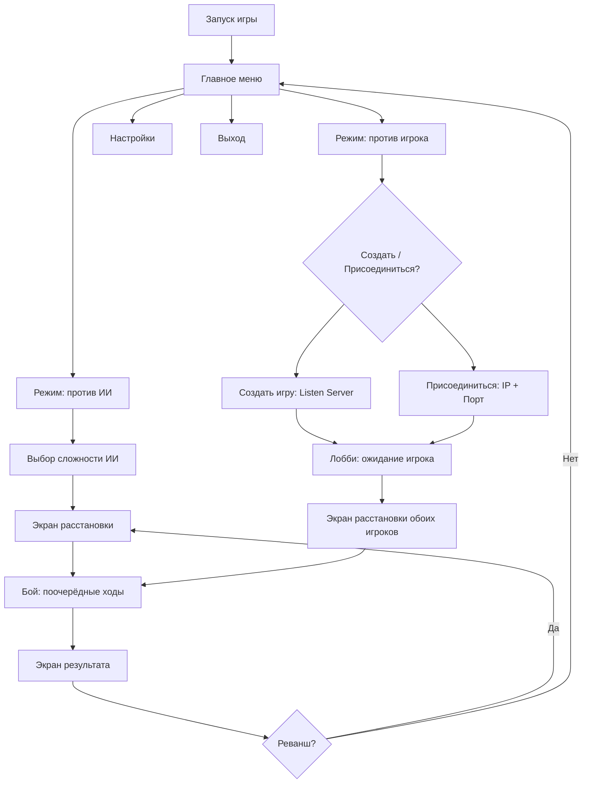

# ГДД «Морской бой» (SeaBattle) — учебный проект, Этап 1 роадмапа

> Версия: 0.2 (юзерфлоу + логика + ИИ + настройки) · Автор: ly4dobra + геймдизайнер (жена) · Дата: авг 2026
> Статус: в разработке (Модуль 4 — система отражения)

---

## 1. HIGH CONCEPT

Классический «Морской бой» на поле 10×10 в двух режимах: **против ИИ** (три уровня сложности)
и **против человека по сети** (listen server). Игровая логика — на чистом C++ (без зависимостей
от UE) → тестируется gtest и демонстрирует чистую архитектуру — «японский козырь №2».

**Питч:** «Тот самый морской бой из тетрадки, но с пиратским кораблём, водой, умным ИИ и другом по сети».

---

## 2. ЦЕЛИ ПРОЕКТА

| Цель | Тип | Критерий успеха |
|---|---|---|
| Освоить Gameplay Framework | Учебная | GameMode/GameState/PlayerController/Pawn используются по назначению |
| Освоить сеть (Listen Server) | Учебная | Полная партия по сети на 2 машинах |
| Чистая архитектура C++ | Техническая | Логика в модуле Core без `#include "Engine/..."`, покрыта gtest |
| ИИ-противник | Техническая | 3 уровня (случайный / охотник / вероятностная карта) + gtest |
| UMG-интерфейс | Учебная | Меню, лобби, поле, экран результата |
| Портфолио | Карьерная | README + скриншоты + видео, репо в GitHub |

---

## 3. ПРАВИЛА (спецификация логики)

### 3.1 Поле и флот
- Поле 10×10, координаты A1…J10 (строки A–J, столбцы 1–10).
- Флот: 1 корабль × 4 палубы, 2 × 3, 3 × 2, 4 × 1 (всего 10 кораблей, 20 клеток).
- Корабли не касаются друг друга (включая углы) — минимум 1 клетка между.
- Корабли можно располагать горизонтально и вертикально.

> **Архитектурно:** размер поля и состав флота — параметры `BattleCore` (не хардкод).
> UI v0.1 показывает только 10×10, но Core умеет 8×8 и 12×12 → богаче gtest, проще включить настройку «размер поля» позже.

### 3.2 Ход игры
- Игроки стреляют по очереди. Ход передаётся только после **промаха**.
- Попадание → повторный ход. Отметка «ранен» / «убит» (когда все палубы корабля поражены).
- Победа: уничтожен весь флот противника.
- Случайный выбор первого хода.

### 3.3 Честная сеть
- Решения принимает сервер (авторитетная логика через `BattleCore`), клиент шлёт намерение (RPC).
- Очередь хода защищена на сервере: клиент не может выстрелить не в свой ход или в уже обстрелянную клетку (ответ `Invalid`).

---

## 4. КАРТА СОСТОЯНИЙ И ЮЗЕРФЛОУ



Ключевой принцип: **обе ветки сходятся в одинаковом бою**. ИИ — это «второй игрок»,
который живёт локально и ходит по алгоритму. Тот же интерфейс, та же логика Core.
Один бой — два источника второго игрока (сеть или ИИ).

---

## 5. ЮЗЕРФЛОУ ПО ЭКРАНАМ

### 5.0 Главное меню
- Заголовок «Морской бой», фон — анимированная вода.
- Поле ввода **имени игрока** (сохраняется в настройки; используется в лобби и статистике).
- Кнопки: **«Против ИИ»**, **«Против игрока»**, **«Настройки»**, **«Выход»**.

### 5.1 Ветка «Против ИИ»
1. **Выбор сложности** (Легко / Средне / Сложно) — под-экран с тремя кнопками.
2. **Экран расстановки** — своя сетка 10×10, панель оставшихся кораблей.
3. **Бой vs ИИ** — поочерёдные ходы, ИИ ходит локально (без сети).
4. **Экран результата** → «Реванш» (новая расстановка, та же сложность) или «В меню».

### 5.2 Ветка «Против игрока»
1. **Окно соединения**:
   - **«Создать игру»** → Listen Server → показать свой `IP:Port` → «Ожидание игрока…» + «Отмена».
   - **«Присоединиться»** → поля **IP** и **Порт** → «Подключиться» + «Отмена».
   - Статус-строка: «Подключение…», «Игрок найден», «Ошибка соединения» (таймаут ~10 сек).
2. **Лобби**: список игроков (оба ника), кнопка «Начать партию» — только у хоста (у клиента неактивна). Отключение соперника → «Соперник вышел» → меню.
3. **Экран расстановки** — оба расставляют одновременно; партия стартует, когда готовы оба.
4. **Бой по сети** — ходы, репликация, смена очереди.
5. **Экран результата** → «Реванш» (обе стороны соглашаются → новый раунд) или «В меню».

### 5.3 Экран расстановки (общий)
- Своя сетка 10×10; панель оставшихся кораблей (1×4, 2×3, 3×2, 4×1).
- Способы: **клик по кораблю + клик по клетке**, поворот клавишей **R**, кнопки **«Авто-расстановка»** и **«Очистить»**.
- Валидация на лету: границы, пересечения, касания. Кнопка **«Готов»** активна только когда флот расставлен полностью.

### 5.4 Экран боя
- **Своя сетка** (видна полностью) + **чужая сетка** (туман войны: только свои выстрелы).
- Индикатор «Ваш ход / Ход противника», счётчики живых кораблей.
- Наведение подсвечивает клетку; клик по чужой сетке = выстрел (только в свой ход).
- Анимации: всплеск (промах), взрыв (попадание), дым (потопление) + звук.

### 5.5 Экран результата
- «Победа!» / «Поражение», статистика: выстрелы, попадания, точность %, время партии.
- Кнопки: «Реванш», «В меню».

---

## 6. ЛОГИКА ПАРТИИ (BattleCore)

### 6.1 Состояния

```cpp
enum class EMatchPhase : uint8 {
    Placement,   // расстановка флота
    Battle,      // бой идёт
    Finished     // есть победитель
};

enum class ETurn : uint8 {
    PlayerA,
    PlayerB
};
```

### 6.2 Обработка выстрела (псевдокод)

```cpp
FShotResult Shoot(FBattleField& EnemyField, const FCellCoord& Cell)
{
    // 1. Клетка уже обстреляна? → Invalid (защита сервера от «читерства»)
    // 2. Пусто → Miss: отметить промах, передать ход
    // 3. Попал в корабль → Hit:
    //    - отметить попадание
    //    - все палубы поражены? → Sunk: отметить «мёртвые клетки» вокруг
    //    - проверить победу (весь флот уничтожен?) → Finished
    //    - попадание/потопление → ход НЕ передаётся (стреляет снова)
}
```

### 6.3 Что покрывается gtest
- Валидация расстановки: границы, пересечения, касания углами.
- Смена хода только после промаха.
- «Мёртвые клетки» вокруг потопленного корабля.
- Победа при уничтожении всего флота.
- Случайный первый ход (детерминированный сид для тестов).
- Конфигурации полей 10×10, 8×8, 12×12.

---

## 7. ИИ-ПРОТИВНИК (три уровня)

| Уровень | Алгоритм | Суть |
|---|---|---|
| **Легко** | Случайный выстрел | Любая необстрелянная клетка |
| **Средне** | «Охотник» (hunt/target) | Случайные выстрелы по «шахматным» клеткам; после попадания — бьёт соседние клетки вокруг, пока не потопит; затем снова поиск |
| **Сложно** | Вероятностная карта | После каждого выстрела строит карту: сколько возможных размещений оставшихся кораблей накрывает клетку → бьёт в максимум. Память о потопленных кораблях |

- ИИ живёт в **Core** (чистый C++) → покрывается gtest:
  - не бьёт в уже обстрелянные/«мёртвые» клетки;
  - карта выбирает центр чаще краёв;
  - корректно перестраивается после потопления;
  - детерминированный сид для воспроизводимых тестов.
- «Сложно» — маленькая, но красивая алгоритмическая задача → строчка в портфолио.

---

## 8. НАСТРОЙКИ

### Core (делаем в М1–М5)
| Настройка | Зачем |
|---|---|
| **Имя игрока** | Лобби, статистика, экран результата |
| **Сложность ИИ** | Выбор в под-меню + дублируется в настройках |
| **Звук: вкл/выкл + громкость** | Ожидание каждого игрока |
| **Скорость анимаций боя** (медленно/норм/быстро) | Контроль темпа, быстрые реванши |

### Stretch (режем первым, если не успеваем)
- **Таймер хода** (выкл / 30 / 60 сек) — напряжение в сетевой игре, трогает логику ходов.
- **Размер поля** (10×10 / 8×8 / 12×12) — Core уже параметризован, остаётся UI.

> Принцип: интерес держат сложность ИИ и «сочность» боя, а не количество настроек.

---

## 9. ТЕХНИЧЕСКАЯ АРХИТЕКТУРА

```
┌────────────────────────────────────────────────────┐
│ UI (UMG): меню, лобби, поле, результат             │  ← Blueprint 20%
├────────────────────────────────────────────────────┤
│ UE-слой (презентация): GameMode, PlayerController, │
│ BoardActor (сетка), ShipActor (корабли)            │  ← C++ 80%
├────────────────────────────────────────────────────┤
│ Сеть: Listen Server, Replication, RPC              │
├────────────────────────────────────────────────────┤
│ CORE (чистый C++): поле, корабли, правила, ИИ,     │
│ расстановка, попадания, победа — БЕЗ UE-зависимостей│  ← gtest
└────────────────────────────────────────────────────┘
```

### Модули (структура Source/)
```
Source/SeaBattle/
  Core/            — чистая логика (без UE)
    Battlefield.h   // поле (параметр размера), корабли, выстрелы
    Ship.h          // корабль: палубы, ориентация, состояние
    GameRules.h     // правила: смена хода, победа, таймер
    ShipPlacer.h    // авто-расстановка
    AI/
      RandomAI.h        // уровень «Легко»
      HunterAI.h        // уровень «Средне»
      ProbabilityAI.h   // уровень «Сложно»
  CoreTests/        — gtest (консольная цель, без UE)
  Game/             — UE-обвязка: GameMode, PlayerController, BoardActor, ShipActor
  UI/               — виджеты UMG (C++ + Blueprint)
```

### Ключевой принцип
`Core` не включает ни одного UE-заголовка. UE-слой вызывает Core, а не наоборот.
Это даёт: gtest без редактора, чистые интерфейсы, быстрый CI.

---

## 10. UI / UX

| Экран | Содержимое |
|---|---|
| Главное меню | Имя игрока, Против ИИ / Против игрока / Настройки / Выход |
| Выбор сложности | Легко / Средне / Сложно |
| Окно соединения | Создать игру (IP:Port) / Присоединиться (IP + Port), статус, отмена |
| Лобби | Список игроков, «Начать партию» (хост), выход |
| Расстановка | Своя сетка, панель кораблей, поворот R, авто-расстановка, «Готов» |
| Бой | Своя сетка + чужая (туман), индикатор хода, счётчики кораблей |
| Результат | Победа/поражение, статистика, «Реванш» / «В меню» |

Принципы: вся нужная информация на одном экране; туман войны — поле противника видно только по своим выстрелам.

---

## 11. АРТ И ЗВУК (минимум, режется первым)

- Стиль: стилизованный low-poly/упрощённый, продолжение Модуля 3 (pirate_ship из Fab, клетка с M_CellMaterial).
- Вода: лёгкая анимация материала, волны.
- Эффекты: всплеск (промах), взрыв/огонь (попадание), дым (потопление).
- Звук: минимальный набор (выстрел, взрыв, плеск).
- **Звук и сложные VFX режутся в первую очередь при нехватке времени.**

---

## 12. СКОУП И «ЧТО РЕЖЕМ»

### Ядро (не трогаем)
- Поле 10×10, флот 10 кораблей, правила ходов, победа.
- Режим «Против ИИ» (минимум «Средне»).
- Режим «Против игрока»: полная партия по сети.
- Логика в Core + gtest (включая ИИ).

### Режется первым (по убыванию)
1. Звук и VFX-полировка.
2. «Сложно» у ИИ (оставить Легко/Средне).
3. Статистика партии, «Реванш» в том же лобби.
4. Ручная расстановка (оставить только авто).
5. Красивое лобби (оставить минимальное).

### Stretch (если останется время)
- Таймер хода (30/60 сек).
- Размер поля 8×8 / 12×12 в UI.
- Чат в лобби. Смена скинов кораблей.

---

## 13. КРИТЕРИИ ГОТОВНОСТИ (Definition of Done)

- [ ] Полная партия по сети на 2 машинах (Windows).
- [ ] Полная партия против ИИ (3 уровня).
- [ ] Логика в Core покрыта gtest: расстановка, попадания/промахи, смена хода, победа, границы поля, ИИ.
- [ ] UI: меню → соединение/сложность → расстановка → бой → результат.
- [ ] README: описание, скриншоты, видео, инструкция запуска, структура.
- [ ] Репо: чистый git, .gitignore для UE, тег v1.0.

---

## 14. МАЙЛСТОУНЫ (привязка к ROADMAP.md)

- **М1 (сент 2026):** Модуль 4 финал + C++ гл. 11–12 → архитектура Core спроектирована (включая AI-интерфейс).
- **М2 (окт 2026):** Модуль 5 + UMG-база + C++ гл. 13–15 → каркас UE-слоя.
- **М3 (ноя 2026):** Core + gtest (поле, корабли, правила, ИИ) → авто-расстановка в UE без сети + режим «Против ИИ» (Легко/Средне).
- **М4 (дек 2026):** сеть: окно соединения, лобби, ходы, репликация, UMG-поля.
- **М5 (янв 2027):** полировка, звук (если успеваем), «Сложно» у ИИ, портфолио-пакет, тест на 2 машинах.

---

## 15. ОТКРЫТЫЕ ВОПРОСЫ

- [ ] Перетаскивание в расстановке: мышью или клик + поворот (выбор UX — жена).
- [ ] Подключение: только LAN по IP или сразу Steam/EOS (решение на М4; для М4 достаточно IP).
- [ ] Таймер хода: включать в v0.1 или в stretch (по умолчанию — stretch).
- [ ] «Реванш» по сети: общее согласие → новая расстановка (просто) или «поменяться полями» (красиво, но дороже).
- [ ] Размер поля в UI: 10×10 в v0.1, остальное — stretch.
