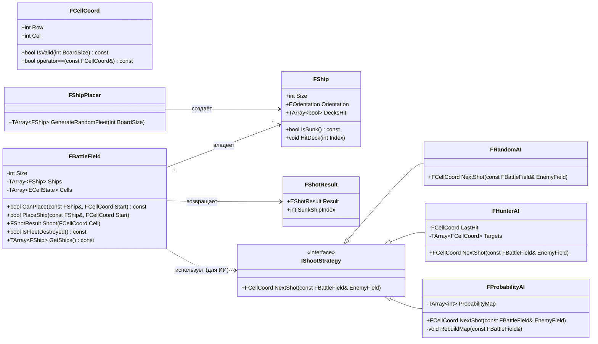
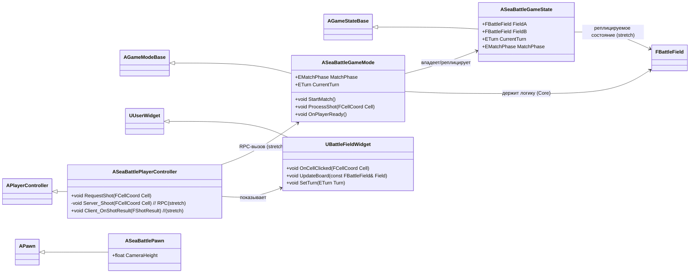

# Архитектура SeaBattle — схемы классов (UML)

> Версия: 1.2 · Дата: авг 2026 · Живой документ: обновлять при изменении кода
> Схемы: **Mermaid classDiagram** — GitHub рендерит их прямо в браузере, без плагинов.
> Как смотреть: открыть этот файл на GitHub → увидеть диаграммы. Или локально: расширение
> «Markdown Preview Mermaid Support» в VS Code.

---

## 1. Два слоя: Core (чистый C++) и UE (движок)

```
┌────────────────────────────────────────────────────┐
│ UI (UMG): меню, расстановка, бой, hot-seat, результат│  ← Blueprint 20%
├────────────────────────────────────────────────────┤
│ UE-слой (презентация)                              │  ← C++ 80%
│ GameMode / GameState / PlayerController / Pawn     │
│ BoardActor / ShipActor / UMG-виджеты               │
├────────────────────────────────────────────────────┤
│ Сеть (stretch): Listen Server, Replication, RPC    │
├────────────────────────────────────────────────────┤
│ CORE (чистый C++, БЕЗ UE-заголовков)               │  ← gtest
│ поле, корабли, правила, ИИ                         │
└────────────────────────────────────────────────────┘
```

**Главное правило:** Core не знает о UE. Стрелки зависимостей идут ТОЛЬКО сверху вниз
(UE → Core). Это даёт: gtest без редактора, чистые интерфейсы, быстрый CI.
**Архитектура Core не зависит от способа «второго игрока»** (ИИ / hot-seat / сеть) —
сеть можно добавить позже без переделки логики (см. ГДД, раздел 16).

---

## 2. Core — игровая логика (без UE, покрывается gtest)



### Ключевые решения Core
- **`FCellCoord`** — маленькая value-структура (ряд + колонка). Никаких UE-векторов в Core.
- **`FBattleField`** — единственная точка входа в логику: расстановка, выстрел, победа.
- **`IShootStrategy`** — интерфейс ИИ (чистая виртуальная). Три реализации = три уровня сложности.
  Подмена стратегии без изменения `FBattleField` — это **полиморфизм** (главы 11–12 Праты).
- Никаких `#include "Engine/..."` — только стандартная библиотека C++.

---

## 3. UE-слой — презентация (сеть — stretch)



### Как это работает (локально — hot-seat, ядро v0.1)
1. Игрок кликает по клетке → `UBattleFieldWidget::OnCellClicked`.
2. Вызов идёт напрямую в `GameMode::ProcessShot` (без сети).
3. `GameMode` вызывает **Core** (`FBattleField::Shoot`) → результат.
4. Виджет обновляется; при промахе — экран «Передайте устройство игроку X».

### Как это будет работать в сети (stretch, если вернёмся)
1. Клиент кликает по клетке → `UBattleFieldWidget::OnCellClicked`.
2. `PlayerController::RequestShot` → RPC на сервер `Server_Shoot`.
3. Сервер: `GameMode::ProcessShot` → **Core** → результат.
4. Сервер обновляет `GameState` → репликация всем → виджеты обновляются.
5. Очередь хода и валидация — на сервере (клиент не может сжульничать).

---

## 4. Как реализовывать в коде (правила)

### 4.1 Заголовок = контракт, .cpp = реализация
```cpp
// Core/Battlefield.h — только объявление (контракт)
#pragma once

struct FCellCoord { ... };
class FBattleField { ... };  // объявления методов

// Core/Battlefield.cpp — реализация
#include "Battlefield.h"
// ... тела методов
```

### 4.2 Интерфейс = чистая виртуальная (для ИИ)
```cpp
// Core/AI/IShootStrategy.h
class IShootStrategy {
public:
    virtual ~IShootStrategy() = default;
    virtual FCellCoord NextShot(const FBattleField& EnemyField) = 0; // = 0 → чистая виртуальная
};
```

### 4.3 UE-классы наследуют движковые (GameMode, Controller...)
```cpp
UCLASS()
class SEABATTLE_API ASeaBattleGameMode : public AGameModeBase
{
    GENERATED_BODY()
    // ...
};
```

### 4.4 Держи схему в синхроне с кодом
- Изменил класс → обнови mermaid-блок в этом файле (1–2 минуты).
- Схема — «карта», а не «закон»: если код ушёл вперёд, схема обновляется за ним.

---

## 5. Альтернативы хранения схем (если захочешь развить)

| Инструмент | Где смотреть | Плюсы | Минусы |
|---|---|---|---|
| **Mermaid (этот файл)** ⭐ | GitHub, VS Code | Рендер на GitHub, живёт в git, diff виден | Нет интерактива |
| PlantUML | Нужен рендер (плагин/CI) | Мощнее, много диаграмм | GitHub не рендерит нативно |
| draw.io (.drawio) | draw.io, VS Code | Интерактив, drag&drop | Бинарный XML, diff плохой |
| Doxygen | Сгенерированный HTML | Авто-доки из кода | Требует настройки, отдельный билд |

**Рекомендация:** Mermaid в `docs/` — нативный рендер GitHub, живая история в git.
Doxygen — опционально на этапе 4, когда код станет большим.

---

## 6. СЕТЬ И КРОСС-ПЛАТФОРМЕННОСТЬ (стратегия)

### 6.1 Модель vs транспорт
- **Модель** (репликация, RPC, авторитет сервера) — ядро движка, универсальна:
  работает одинаково на LAN, в интернете, на выделенном сервере и на консолях.
- **Транспорт/сервисы (OSS)** — «как найти соперника и соединиться»: лобби, NAT traversal,
  друзья, матчмейкинг. Это сменный нижний слой.

### 6.2 OSS: Null / Steam / EOS

| Реализация | Когда | Что даёт |
|---|---|---|
| **Null** | М4 (stretch) | Голая сеть по IP: репликация, RPC, авторитет. Ноль зависимостей, нет лобби/NAT |
| **Steam** | М4-stretch апгрейд | Лобби, приглашения, NAT traversal. Только через OSS! |
| **EOS** | Этап 4 (М32) | Кроссплей PC + консоли, один API. Разработка без девкитов |

### 6.3 Почему начинаем с Null (а не сразу Steam)
1. **Фокус на модели** — учебная цель М4: понять репликацию и авторитет сервера, а не сессии.
2. **Ноль внешних зависимостей** — Steam SDK не нужен: ни скачивания, ни ключей.
3. **Меньше магии** — видна «голая» сеть: IP, порт, трафик. Лучший способ понять, что происходит.
4. **Лёгкий апгрейд** — `Null → Steam` = строчка конфига + работа с сессиями через OSS-интерфейсы.
   Геймплей не трогается.

### 6.4 Железное правило
Геймплей **НИКОГДА не вызывает Steam SDK напрямую** (`steam/steamapi.h`).
Только OSS-интерфейсы (`IOnlineSession`, `IOnlineFriends`, ...). Тогда смена платформы =
правка конфига + ограниченная доработка сессий, а не переделка геймплея.
> Начиная с UE 5.4 актуальна версия API **Online Services (OSSv2)** — она заточена под EOS/кроссплей.
> Её и осваиваем к Этапу 4.

### 6.5 Смена транспорта — пример (DefaultEngine.ini)
```ini
[OnlineSubsystem]
DefaultPlatformService=Null        ; сейчас (разработка / подключение по IP)
; DefaultPlatformService=Steam     ; позже (М4-stretch: лобби через интернет)
; DefaultPlatformService=EOS       ; этап 4 (кросс-платформа, PC + консоли)
```

### 6.6 «Консоль-реди» привычки (закладываем с Морского боя)
- **Enhanced Input** — геймпад работает из коробки.
- **UMG**: навигация геймпадом, SafeZone.
- **Локализация** RU/EN/JA (уже в плане).
- **Чистый Core без UE** — переносимость логики.

### 6.7 Почему это важно
Этап 4 — кооп до 14 человек + цель «консоли в Японии». Сетевую модель учим на Морском бое
(дешёвый полигон), транспорт подключаем через OSS/EOS, чтобы «под консоли потом» не переделывать код.
